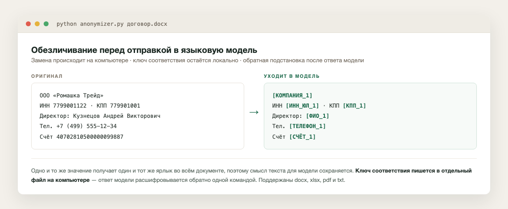

# Anonymizer — обезличиватель документов для работы с LLM

**Локальный инструмент обезличивания конфиденциальных документов перед отправкой в ChatGPT, Claude и другие LLM. Данные не покидают ваш компьютер.**

```
Оригинал                          Обезличенный документ
┌─────────────────────────┐       ┌─────────────────────────┐
│ ООО «Ромашка Трейд» │       │ [КОМПАНИЯ_1]            │
│ ИНН: 7799001122         │  ──►  │ ИНН: [ИНН_ЮЛ_1]        │
│ Директор: Кузнецов А.В.  │       │ Директор: [ФИО_1]       │
│ Тел: +7 (499) 555-12-34│       │ Тел: [ТЕЛЕФОН_1]        │
└─────────────────────────┘       └─────────────────────────┘
         ▲                                    │
         │         ┌──────────┐               │
         │         │ Claude / │               ▼
         └─────────│ ChatGPT  │◄──────────────┘
    Расшифровка    │          │   Анализ обезличенного
    по ключам      └──────────┘   документа
```



## Зачем это нужно

Кредитные аналитики, CFO, юристы и финансисты работают с документами, которые содержат персональные данные и коммерческую тайну: договоры, бухгалтерскую отчётность, финансовые модели, кредитные меморандумы. Отправлять такие документы в облачные LLM напрямую — нарушение конфиденциальности и, зачастую, закона (152-ФЗ).

**Anonymizer** решает эту проблему:

1. **Обезличивает** — заменяет конфиденциальные данные на плейсхолдеры `[КОМПАНИЯ_1]`, `[ИНН_ЮЛ_1]`, `[ФИО_2]`
2. **Сохраняет файл ключей** — JSON-таблицу соответствий `плейсхолдер → оригинал`
3. **Расшифровывает обратно** — подставляет реальные данные в результат работы LLM

## Чем лучше существующих решений

### vs Microsoft Presidio
| | Presidio | Anonymizer |
|---|---|---|
| Язык | Английский (русский — слабо) | **Русский — нативно** |
| Зависимости | spaCy + модель ~560 МБ | **0 МБ** (NER-слой — опционально, ~30 МБ) |
| ИНН ЮЛ vs ФЛ | Не различает | **Различает** (10 и 12 цифр) |
| КПП, ОГРН, БИК, СНИЛС | Не знает | **Знает** |
| Кадастровые номера | Нет | **Да** |
| Падежи ФИО | Ломается | **Работает** (Иванова Ивана Ивановича) |
| Unicode-нормализация | Нет | **Да** (decomposed → composed) |
| Обратная расшифровка | Нет встроенной | **Есть** (--restore + файл ключей) |
| Установка | pip install + модель + конфиг | **Скачал → запустил** |

### vs Браузерные инструменты
| | HTML-обезличиватели | Anonymizer |
|---|---|---|
| Форматы | Обычно только текст или xlsx | **docx, xlsx, pdf, txt, html, csv, md** |
| Сохранение формата | Нет | **Да** (docx → docx с форматированием) |
| Пакетная обработка | Нет | **Да** (несколько файлов за раз) |
| Обратная расшифровка | Ручная или нет | **Автоматическая** |

### vs Облачные DLP-сервисы
| | Облачные DLP | Anonymizer |
|---|---|---|
| Где работает | Облако провайдера | **Локально на вашем компьютере** |
| Данные уходят на сервер | Да | **Нет** |
| Стоимость | $10–100/мес | **Бесплатно** |
| Работает офлайн | Нет | **Да** |

### vs Ручной find-and-replace
| | Вручную | Anonymizer |
|---|---|---|
| Время на документ | 15–30 минут | **2 секунды** |
| Человеческий фактор | Пропуски, ошибки | **Консистентно** |
| Дедупликация | Нет | **Да** (одно значение → один плейсхолдер) |
| Обратная расшифровка | Ручная | **Автоматическая** |

## Что обезличивается

| Плейсхолдер | Что находит | Пример |
|---|---|---|
| `[КОМПАНИЯ_1]` | ООО, АО, ПАО, ИП и др. | ООО «Ромашка Трейд» |
| `[ФИО_1]` | Фамилия Имя Отчество (все падежи) | Кузнецова Андрея Викторовича |
| `[ИНН_ЮЛ_1]` | ИНН юридического лица (10 цифр) | 7799001122 |
| `[ИНН_ФЛ_1]` | ИНН физического лица (12 цифр) | 503300112233 |
| `[КПП_1]` | Код причины постановки | 779901001 |
| `[ОГРН_1]` | ОГРН / ОГРНИП | 1157799001122 |
| `[СЧЁТ_1]` | Расчётный / корр. счёт (20 цифр) | 40702810500000099887 |
| `[БИК_1]` | Банковский идентификатор | 044525999 |
| `[SWIFT_1]` | SWIFT-код | ROMTRUXX |
| `[ТЕЛЕФОН_1]` | Номер телефона | +7 (499) 555-12-34 |
| `[EMAIL_1]` | Электронная почта | ivanov@romashka.ru |
| `[ПАСПОРТ_1]` | Серия и номер паспорта | 4510 № 223344 |
| `[СНИЛС_1]` | Страховой номер | 12345678901 |
| `[ДР_1]` | Дата рождения | 15.06.1985 |
| `[ДАТА_ВЫДАЧИ_1]` | Дата выдачи документа | 20.09.2022 |
| `[МЕСТО_РОЖДЕНИЯ_1]` | Место рождения | г. Тверь Тверской обл. |
| `[АДРЕС_1]` | Адрес (регистрации, юридический) | г Самара, ул Мира, д 7, кв 42 |
| `[ВЫДАН_1]` | Кем выдан паспорт | УМВД РОССИИ ПО ТВЕРСКОЙ ОБЛ. |
| `[КОД_ПОДР_1]` | Код подразделения | 690-005 |
| `[КАДАСТР_1]` | Кадастровый номер | 50:27:0020301:1234 |
| `[ЕГРН_1]` | Номер записи ЕГРН | 50:27:0020301:1234-50/012/2024-1 |
| `[ПРОЕКТ_1]` | Название проекта (в кавычках) | Проект «Солнечная Долина» |

Дополнительно (выключены по умолчанию):
- `[СУММА_1]` — денежные суммы (12 500 000 ₽)
- `[ДАТА_1]` — все даты (01.09.2024)

## Поддерживаемые форматы

| Формат | Обезличивание | Расшифровка | Примечание |
|---|---|---|---|
| `.docx` | ✅ | ✅ | Форматирование сохраняется |
| `.xlsx` | ✅ | ✅ | |
| `.pdf` | ✅ | — | Результат в `.md` (PDF нельзя редактировать) |
| `.txt` | ✅ | ✅ | |
| `.md` | ✅ | ✅ | |
| `.html` | ✅ | ✅ | |
| `.csv` | ✅ | ✅ | |

## Быстрый старт

### Установка

```bash
# Клонировать репозиторий
git clone https://github.com/ВАШ_ЮЗЕРНЕЙМ/anonymizer.git
cd anonymizer

# Установить зависимости
pip3 install python-docx openpyxl pdfplumber --break-system-packages

# Опционально: NER-слой (нейросетевое распознавание ФИО и организаций)
pip3 install natasha --break-system-packages
```

### Использование из командной строки

```bash
# Обезличить
python3 anonymizer.py договор.docx отчёт.xlsx

# Результат:
#   договор_anon.docx     — обезличенная копия
#   отчёт_anon.xlsx       — обезличенная копия
#   ключи_20240315.json   — файл ключей

# Расшифровать
python3 anonymizer.py --restore результат_из_claude_anon.docx ключи_20240315.json

# Результат:
#   результат_из_claude_restored.docx — с реальными данными
```

### Установка на macOS (кнопки на рабочем столе)

Кнопки запускают `anonymizer.py` прямо из папки репозитория
(путь задан в переменной `SCRIPT_DIR` внутри `.command`-файлов —
поправьте, если клонировали не в `~/ClaudeProjects/real/anonymizer`).

```bash
# Скопировать кнопки на рабочий стол
cp Обезличить.command Расшифровать.command ~/Desktop/

# Дать права на запуск
chmod +x ~/Desktop/Обезличить.command ~/Desktop/Расшифровать.command
```

Двойной клик по кнопке → выбрать файлы → готово.

## Рабочий процесс с LLM

```
1. Обезличить.command → выбрать файл(ы)
        ↓
2. Получить filename_anon.docx + ключи_дата.json
        ↓
3. Скопировать текст из _anon файла → вставить в Claude/ChatGPT
        ↓
4. Получить результат от LLM (с плейсхолдерами)
        ↓
5. Сохранить результат в файл
        ↓
6. Расшифровать.command → выбрать файл + ключи
        ↓
7. Получить filename_restored.docx с реальными данными
```

## Файл ключей

```json
{
  "[КОМПАНИЯ_1]": { "original": "ООО «Ромашка Трейд»", "type": "КОМПАНИЯ" },
  "[ИНН_ЮЛ_1]":  { "original": "7799001122",              "type": "ИНН_ЮЛ" },
  "[ФИО_1]":      { "original": "Кузнецов Андрей Викторович", "type": "ФИО" }
}
```

> ⚠️ **Храните файл ключей отдельно от обезличенных документов. Никому не передавайте — в нём реальные данные.**

## Личный словарь клиентов

Названия ваших клиентов — самая чувствительная строка документа, но именно их не знает
ни один универсальный инструмент: латиница без ОПФ («FinClever»), внутренние имена проектов,
фамилии контактов. Для них есть **личный словарь** — нулевой проход с приоритетом
над regex и NER.

1. Скопируйте `словарь_клиентов.example.txt` → `словарь_клиентов.txt` (рядом со скриптом)
2. Впишите по одной записи на строку; метка по умолчанию — КОМПАНИЯ, другую можно
   указать через `|`: `Малахова Ксения | ФИО`, `Солнечная Долина | ПРОЕКТ`
3. Для русских названий падежные окончания подбираются автоматически по каждому слову:
   «Ромашка Трейд» найдёт и «Ромашкой Трейд», «Солнечная Долина» — и «Солнечной Долины»

`словарь_клиентов.txt` внесён в `.gitignore` — клиентские данные не попадают в репозиторий.
Отключение: `--no-dict`.

## NER-слой (Natasha)

Если установлена библиотека [natasha](https://github.com/natasha/natasha), после regex-прохода
выполняется второй проход — нейросетевой NER (Slovnet, качество ~на 1 п.п. ниже DeepPavlov BERT,
работает на CPU). Он добирает то, что не покрыто шаблонами:

- ФИО без отчества («Ксения Малахова») и одиночные фамилии в тексте («Малахова подтвердила…»)
- Организации без организационно-правовой формы («Совкомбанк», «Газпромбанком» — в любом падеже)

Regex-слой всегда идёт первым: структурные реквизиты (ИНН, СНИЛС, счета) распознаются
шаблонами со 100% точностью, NER их не перехватывает. Нумерация плейсхолдеров и
дедупликация — сквозные для обоих слоёв.

- NER включён автоматически, если natasha установлена; отключение: `python3 anonymizer.py --no-ner файл.docx`
- Статус слоя печатается при запуске: `NER-слой: включён (Natasha)`
- Без natasha инструмент работает как раньше (только regex)

## Словарный добор фамилий (pymorphy3)

NER пропускает фамилии **точечно**: «Морозова прислала смету» проходит насквозь, хотя
«Морозов прислал смету» и «Малахова подтвердила получение» распознаются. Замер на
36 сочетаниях (6 фамилий × пол × падеж × позиция) дал 3 пропуска — это промахи модели
на конкретных словах, а не правило вроде «женская фамилия в начале фразы».

Поэтому есть третий проход: слово с большой буквы, которое словарь
[pymorphy3](https://github.com/no-plagiarism/pymorphy3) знает как **фамилию** (`Surn`)
и **не знает** как имя или отчество (`Name`/`Patr`), маскируется как ФИО.

Сужение «и не имя» принципиально: без него правило маскирует «Роман» в «Роман с
продолжением» — фамилия Роман существует. С ним нетронутыми остаются «Вера в успех»,
«Роман с продолжением», «Любовь и голуби».

- Слой только **добавляет** маскировку и никогда её не снимает
- Цена названа: слово, которое одновременно фамилия и обычное слово, маскируется
  лишнего — из 21 проверенного делового слова таким оказалось одно, «Мороз»
- Без pymorphy3 инструмент работает как раньше; статус печатается при запуске

## Технические особенности

- **Unicode NFC-нормализация** — корректно обрабатывает docx с decomposed-символами (и+̆ → й), что часто встречается в документах из разных редакторов
- **Умная предобработка ПД-4** — корректно разделяет склеенные реквизиты в платёжных квитанциях (30 цифр → ИНН 10 + счёт 20)
- **Дедупликация** — одно и то же значение во всём документе получает один плейсхолдер
- **Группы захвата** — метки типа «ИНН поручителя:» сохраняются, заменяется только число
- **Порядок правил** — длинные паттерны (счёт 20 цифр) применяются раньше коротких (ИНН 10 цифр), исключая ложные срабатывания
- **Границы предложения в адресах** — захват адреса останавливается на точке конца предложения («…д. 7. Контакт: …»), не глотая последующий текст; точки сокращений (г., ул., д., корп., инициалы) границей не считаются
- **Многопроходная расшифровка** — если внутри развёрнутого значения оказался ещё один плейсхолдер, замены повторяются до полного восстановления (с лимитом итераций)

## Ограничения

- **PDF** → текст извлекается и сохраняется как `.md` (редактирование PDF без платных инструментов невозможно)
- **Сканы** — если PDF содержит только изображения (без текстового слоя), обезличивание не сработает
- **Адрес в нескольких ячейках таблицы** — если адрес разбит на разные параграфы/ячейки, вторая часть может не захватиться
- **Латиница без ОПФ** — названия вроде «FinClever» без «ООО» NER-слой ловит слабо (модель Natasha обучена на русских новостях). Всегда проверяйте результат перед отправкой в LLM
- **Без natasha** — работает только regex-слой: ФИО без отчества и компании без ОПФ пропускаются

## Тесты

Регресс-тесты (stdlib `unittest`, без дополнительных зависимостей):

```bash
python3 -m unittest discover tests -v
```

## Лицензия

MIT — используйте свободно, в том числе в коммерческих целях.

## Авторы

Создано при помощи Claude (Anthropic) в рамках курса Prompt Engineering.
